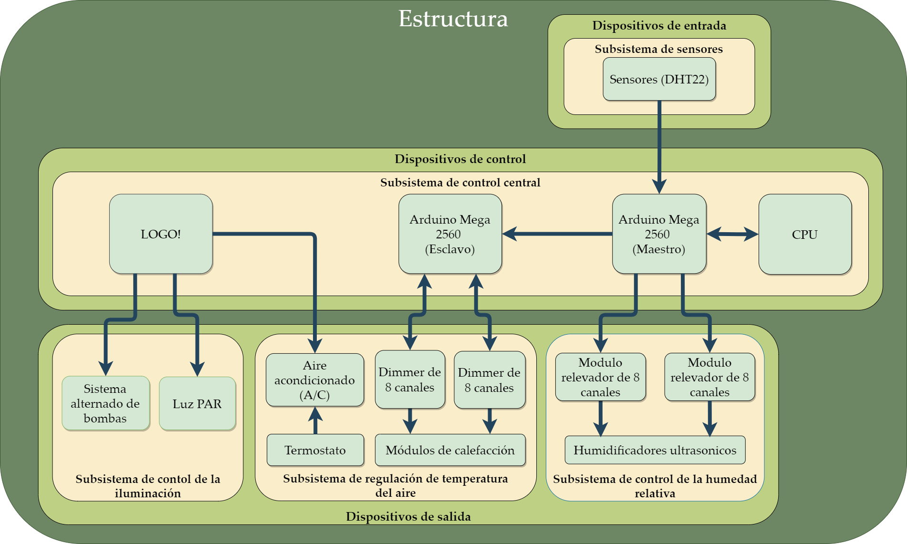
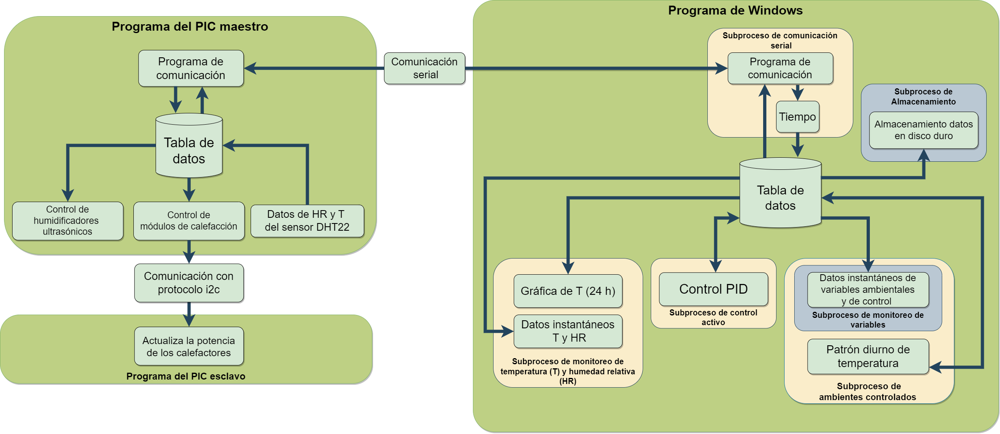
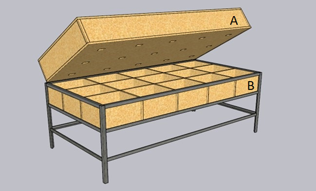
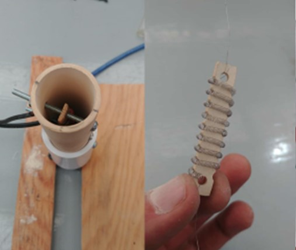

    
# SISTEMA DE CONTROL AMBIENTAL MULTICAMARA

## Resumen
En este apartado se presentarán los anexos correspondientes al artículo titulado "Desarrollo y Evaluación de un Sistema de Control Ambiental Multicámara". 
Los anexos contienen información detallada sobre los materiales utilizados en la construcción del sistema y los componentes de los subsistemas de entrada, 
control y salida. Además, se proporciona una visión general de cómo se diseñó el sistema y se incluyen diagramas que ilustran la disposición de los 
dispositivos y el flujo de la aplicación de control.

## Contenido
- [Descripción general del sistema](#Descripción-general-del-sistema)
- [Hardware](#Hardware)
  - [Estructura](#Estructura)
  - [Dispositivos de entrada](#Dispositivos-de-entrada)
  - [Dispositivos de salida](#Dispositivos-de-salida)
  - [Dispositivos de control](#Dispositivos-de-control)
- [Instalación](#instalación)
- [Uso](#uso)
- [Contribución](#contribución)
- [Licencia](#licencia)

## Descripción general del sistema

**Figura 1.** Diagrama de flujo del hardware. Interacción entre los dispositivos de entrada (subsistema de sensores), 
los dispositivos de salida (subsistema de control de la temperatura del aire, subsistema de control de la humedad 
relativa y subsistema de control de la iluminación) y los dispositivos de control (subsistema de control central). 
Todos los dispositivos están instalados en la estructura.

**Figura 2.** Diagrama de flujo del software de control (aplicación de Windows® y PICs (maestro y esclavo) del sistema 
de control ambiental múltiple.

## Hardware

### Estructura

Consta de un armazón de angular de hierro, con dimensiones de 1.22 m de largo, 2.44 m de ancho y 0.75 m de altura. Este soporte cuenta con 15 compartimientos o cámaras de crecimiento organizadas en un arreglo matricial de 3 x 5. Cada cámara de crecimiento se delimitó con aislante térmico, formando un cubo de 0.30 m por lado (27 dm3), una vez excluido el volumen del aislante (Figura 3B).
Por otro lado, la tapa se diseñó como un prisma rectangular con dimensiones de 1.22 m de largo, 2.44 m de ancho y 0.225 m de altura. Esta tapa cumple varias funciones: Cubre y sella las cámaras de crecimiento, sirve como base para fijar el sistema de iluminación, y también actúa como la vía de salida del aire procedente de cada cámara de crecimiento (Figura 3A).

 
**Figura 3.** Subsistema estructural. A: tapa; B: Soporte (armazón y compartimientos para las cámaras de crecimiento).

### Dispositivos de entrada
### Dispositivos de salida
**Subsistema de control de la temperatura del aire.** El subsistema encargado de regular la temperatura del aire consta de dos componentes: El módulo de enfriamiento y el módulo de calefacción. El módulo de enfriamiento se compone de un equipo de aire acondicionado (A/C) de la marca LG® con una capacidad de 12000 BTU por hora. Además, el sistema cuenta con tres extractores de la marca iPower® de 195 CFM que contribuyen al proceso de flujo del aire. Para controlar el encendido y apagado del compresor, se utilizó un módulo de termostato con pantalla de la marca Steren®.
 
Por otro lado, el módulo de calefacción fue construido a partir de un tubo aislante de cerá-mica de 10 cm (N° 10). Se empleó una resistencia de alambre de nicromo (34 AWG) de 170 Ω, lo que permite que el módulo funcione de 0 a 127 V, con una corriente máxima de 0.74 A (Figura 4D). La resistencia fue enrollada en un porta-resistencias (Figura 4C) también cons-truido a partir de tubo aislante de cerámica, y fijada al interior del tubo (Figura 4A) me-diante dos tornillos con tuercas (Figura 4B) que a su vez cumplen la función de pines de la resistencia. Para soportar las altas temperaturas, el tubo aislante de cerámica se adhirió con silicón térmico a un cople (1 pulgada) y una tuerca unión de PVC hidráulico de una pulgada.

 
**Figura 4.** Módulo de calefacción. A: Tubo aislante de cerámica; B: Tornillos de sujeción para la resistencia nicromo; C: Porta-resistencia; D: Resistencia de alambre de nicromo.

El mecanismo para el control de la temperatura se describe a continuación: El flujo de aire a 16 °C proviene del serpentín del A/C (Figura 5A) y se dirige hacia las cámaras a través de tres líneas de tubería de PVC hidráulico de 25.4 mm (1 pulgadas). Cada una de estas líneas alimenta a cinco cámaras (Figura 5B). Para regular el flujo de aire en cada línea, se emplea un extractor (Figura 5C) cuya velocidad es ajustada mediante un regulador de intensidad (“dimmer”) de la marca Leviton RNL06-10Z. El aire fluye a través de las tuberías de PVC situadas en la base de cada cámara y es conducido hacia los módulos de calefacción (Figura 5D). Estos módulos se encargan de calentar el aire hasta alcanzar la temperatura objetivo. Luego, el aire caliente es conducido hacia una salida ubicada en la parte superior de cada cámara (Figuras 5F). Por último, el aire caliente se colecta en una red de tubería de PVC de 55 mm antes de ser liberado al exterior del sistema (Figura 5G). 

 

### Dispositivos de control

## Instalación

Proporciona instrucciones claras sobre cómo instalar y configurar tu proyecto. Incluye ejemplos de comandos si es necesario.

| Encabezado 1 | Encabezado 2 | Encabezado 3 |
| ------------ | ------------ | ------------ |
| Celda 1,1     | Celda 1,2     | Celda 1,3     |
| Celda 2,1     | Celda 2,2     | Celda 2,3     |
| Celda 3,1     | Celda 3,2     | Celda 3,3     |

