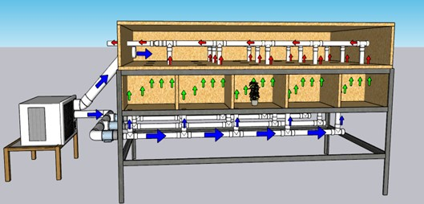
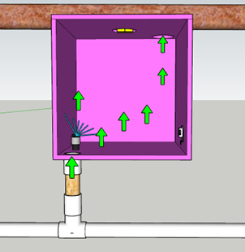
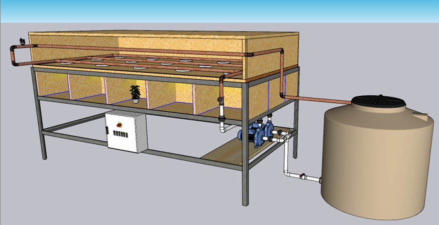
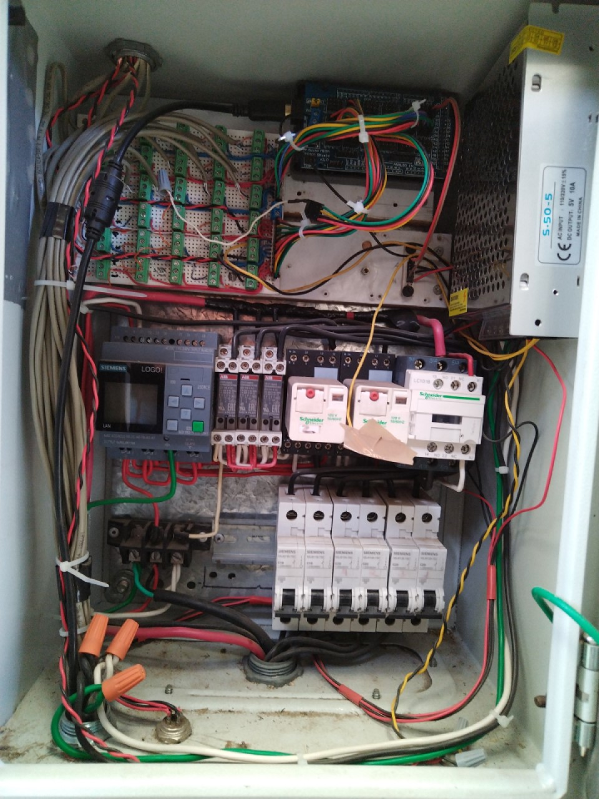

    
# SISTEMA DE CONTROL AMBIENTAL MULTICAMARA

## Resumen
En este apartado se presentarán los anexos correspondientes al artículo titulado "Desarrollo y Evaluación de un Sistema de Control Ambiental Multicámara". 
Los anexos contienen información detallada sobre los materiales utilizados en la construcción del sistema y los componentes de los subsistemas de entrada, 
control y salida. Además, se proporciona una visión general de cómo se diseñó el sistema y se incluyen diagramas que ilustran la disposición de los 
dispositivos y el flujo de la aplicación de control.

## Contenido
- [Descripción general del sistema](#Descripción-general-del-sistema)
- [Hardware](#Hardware)
  - [Estructura](#Estructura)
  - [Dispositivos de entrada](#Dispositivos-de-entrada)
  - [Dispositivos de salida](#Dispositivos-de-salida)
  - [Dispositivos de control](#Dispositivos-de-control)
- [Software](#Software)
  - [Aplicación para Windows](#Aplicación-para-Windows)
  - [Código de control para Arduino](#Condigo-de-control-para-Arduiono)
- [Lista de materiales](#Lista-de-materiales)

## Descripción general del sistema

**Figura 1.** Diagrama de flujo del hardware. Interacción entre los dispositivos de entrada (subsistema de sensores), 
los dispositivos de salida (subsistema de control de la temperatura del aire, subsistema de control de la humedad 
relativa y subsistema de control de la iluminación) y los dispositivos de control (subsistema de control central). 
Todos los dispositivos están instalados en la estructura.

**Figura 2.** Diagrama de flujo del software de control (aplicación de Windows® y PICs (maestro y esclavo) del sistema 
de control ambiental múltiple.

## Hardware

### Estructura

Consta de un armazón de angular de hierro, con dimensiones de 1.22 m de largo, 2.44 m de ancho y 0.75 m de altura. Este soporte cuenta con 15 compartimientos o cámaras de crecimiento organizadas en un arreglo matricial de 3 x 5. Cada cámara de crecimiento se delimitó con aislante térmico, formando un cubo de 0.30 m por lado (27 dm3), una vez excluido el volumen del aislante (Figura 3B).
Por otro lado, la tapa se diseñó como un prisma rectangular con dimensiones de 1.22 m de largo, 2.44 m de ancho y 0.225 m de altura. Esta tapa cumple varias funciones: Cubre y sella las cámaras de crecimiento, sirve como base para fijar el sistema de iluminación, y también actúa como la vía de salida del aire procedente de cada cámara de crecimiento (Figura 3A).

 
**Figura 3.** Subsistema estructural. A: tapa; B: Soporte (armazón y compartimientos para las cámaras de crecimiento).

### Dispositivos de entrada
### Dispositivos de salida
**Subsistema de control de la temperatura del aire.** El subsistema encargado de regular la temperatura del aire consta de dos componentes: El módulo de enfriamiento y el módulo de calefacción. El módulo de enfriamiento se compone de un equipo de aire acondicionado (A/C) de la marca LG® con una capacidad de 12000 BTU por hora. Además, el sistema cuenta con tres extractores de la marca iPower® de 195 CFM que contribuyen al proceso de flujo del aire. Para controlar el encendido y apagado del compresor, se utilizó un módulo de termostato con pantalla de la marca Steren®.
 
Por otro lado, el módulo de calefacción fue construido a partir de un tubo aislante de cerá-mica de 10 cm (N° 10). Se empleó una resistencia de alambre de nicromo (34 AWG) de 170 Ω, lo que permite que el módulo funcione de 0 a 127 V, con una corriente máxima de 0.74 A (Figura 4D). La resistencia fue enrollada en un porta-resistencias (Figura 4C) también cons-truido a partir de tubo aislante de cerámica, y fijada al interior del tubo (Figura 4A) me-diante dos tornillos con tuercas (Figura 4B) que a su vez cumplen la función de pines de la resistencia. Para soportar las altas temperaturas, el tubo aislante de cerámica se adhirió con silicón térmico a un cople (1 pulgada) y una tuerca unión de PVC hidráulico de una pulgada.

 
**Figura 4.** Módulo de calefacción. A: Tubo aislante de cerámica; B: Tornillos de sujeción para la resistencia nicromo; C: Porta-resistencia; D: Resistencia de alambre de nicromo.

El mecanismo para el control de la temperatura se describe a continuación: El flujo de aire a 16 °C proviene del serpentín del A/C (Figura 5A) y se dirige hacia las cámaras a través de tres líneas de tubería de PVC hidráulico de 25.4 mm (1 pulgadas). Cada una de estas líneas alimenta a cinco cámaras (Figura 5B). Para regular el flujo de aire en cada línea, se emplea un extractor (Figura 5C) cuya velocidad es ajustada mediante un regulador de intensidad (“dimmer”) de la marca Leviton RNL06-10Z. El aire fluye a través de las tuberías de PVC situadas en la base de cada cámara y es conducido hacia los módulos de calefacción (Figura 5D). Estos módulos se encargan de calentar el aire hasta alcanzar la temperatura objetivo. Luego, el aire caliente es conducido hacia una salida ubicada en la parte superior de cada cámara (Figuras 5F). Por último, el aire caliente se colecta en una red de tubería de PVC de 55 mm antes de ser liberado al exterior del sistema (Figura 5G). 

 
**Figura 5.** Diagrama del flujo de aire para la regulación de la temperatura en las cámaras de crecimiento del subsistema de control de la temperatura del aire. A: Aire acondicionado (A/C); B: Tubería PVC para ingresar el aire a 16 °C a las cámaras de crecimiento; C: Extractores de aire; D: Módulo de calefacción; E: Orificio para la entrada de aire de las cámaras de crecimiento; F: Orificio de salida de aire de las cámaras de crecimiento; G: Red de tubería de PVC de 55 mm; H: Tubería de aire frio. Flechas azules indican flujo de aire frio. Flechas verdes indican el flujo de aire calentado por el módulo de calefacción. Flechas rojas indican el flujo de aire liberado al exterior del sistema. 

**Subsistema de control de la humedad relativa.** Para el control de la humedad relativa, se instalaron humificadores de membrana ultrasónica de 16 mm en el interior de cada cámara de crecimiento (Figura 6C). Estos microaspersores generan una brisa de microgotas de agua para aumentar y regular la humedad relativa, ya que el aire tiende a desecarse al pasar a través del evaporador del A/C. 

 
**Figura 6.** Representación gráfica de un corte en el eje vertical de una cámara de crecimiento para mostrar los elementos responsables de regular de la humedad relativa en el subsistema de control de la humedad relativa. A: Tubería de ingreso de aire frio a la cámara de crecimiento; B: Módulo de calefacción; C: Humificador ultrasónico; D) Lámpara LED; E: Orificio de salida de aire; F: Sensor DHT22 de humedad relativa y temperatura; G: Tubería para el flujo de agua fría, encargada de absorber el calor emitido por la lámpara LED.

**Subsistema de control de la iluminación.** En cada cámara de crecimiento, se instaló un “Led Chip Full Spectrum Plant Grow Light” que emite 130 μmol s-1 m-2 de densidad de flujo de fotones fotosintéticos (DFFF) en 380 nm (luz azul) y 840 nm (luz roja). Sin embargo, debido a la emisión alta de energía calórica de estos LEDS durante su funcionamiento, se usó un método de enfriamiento basado en la recirculación de agua. La función de este arreglo es extraer por conducción el calor producido por los LEDS y mantenerlos dentro del rango de temperatura de operación. Este método de enfriamiento resulta más eficiente en comparación con la solución comercial de enfriamiento por convección forzada (mediante un ventilador) que usa un disipador térmico de aluminio unido a la parte posterior del LED, el cual incrementaría la temperatura del aire circundante a las plantas. Para el recirculamiento de agua, se usaron dos bombas periféricas de la marca Truper® de 1/2 HP que alternan su funcionamiento cada 15 min. Estas bombas hacen circular el agua a través de tubos de cobre dispuestos en tres líneas principales y alineadas de forma paralela a lo largo de la base interna del compartimiento de mezcla de aire (Figura 7A). Cada línea de tubo de cobre pasa por encima y al centro de cada cámara de crecimiento. Las tuberías de entrada y salida de agua se conectaron a un tinaco (Figura 7D). Además, para evitar un aumento significativo de temperatura generado por el calentamiento de las tuberías de cobre y la influencia de la temperatura al exterior del sistema multicámaras, se introduce aire frío al interior de la tapa, directamente del aire acondicionado (A/C) mediante una tubería de 4 pulgadas (Figuras 5H). Los LEDS se colocaron en la cara inferior de la tubería de cobre de modo que se alinearan con la parte superior central de cada cámara de crecimiento (Figura 7C). Para asegurar una correcta adhesión y transferencia de calor, se moldeó la superficie de unión con un mazo y después se pulió para facilitar la adhesión, con silicón para temperaturas altas, de cada chip de los leds a los tubos de cobre. Además, se aplicó una pasta térmica en la unión para mejorar la transmisión de calor.

 
**Figura 7.** Subsistema de control de la iluminación. A: Tubería de enfriamiento de los LEDS; B: Arreglo de bombas para alternar el bombeo de agua; C: Chips led adheridos a la tubería de cobre; D: Tinaco.

### Dispositivos de control
**Subsistema de control central.** La sección de control central cuenta con dos PIC: un maestro y un esclavo, ambos basados en el microcontrolador Arduino® Mega 2560 con el chip ATmega2560. Estos PIC permiten el control de los dispositivos de entrada y salida. El PIC maestro (Figura 8A) se encarga de la comunicación serial bidireccional con la computadora (CPU), recibiendo los valores de HR (%) y temperatura del aire (°C) del sensor DHT22 presente en cada cámara de crecimiento. Además, este PIC está conectado a dos módulos de relevadores mecánicos, los cuales permiten controlar el encendido de los humidificadores (Figura 9). Por otro lado, el PIC esclavo (Figura 8B) está conectado dos módulos “dimmer" de 8 canales (Figura 8C). Estos módulos permiten regular la intensidad del voltaje de corriente alterna que alimenta los módulos de calefacción. El encendido tanto del sistema de iluminación como del arreglo de bombeo alternado para el enfriamiento de los leds es gestionado por un MiniPLC (LOGO!) de Siemens© (Figura 8C).

 
 
**Figura 8.** Subsistema de control central. A: Microcontrolador maestro Arduino® Mega 2560 con el chip ATmega2560; B: Microcontrolador esclavo Arduino® Mega 2560 con el chip ATmega2560; C: Módulos “dimmer" de 8 canales; D: MiniPLC (LOGO!) de Siemens©.

## Software

### Aplicación para Windows
La aplicación de Windows esta alojada en una computadora de escritorio (CPU) y cuenta con diversas funciones. Una de ellas es establecer una comunicación serial bidi-reccional con en el PIC maestro del subsistema de control central (Figura 2). Además, la aplicación tiene la capacidad de controlar las variables ambientales, como temperatura del aire y la humedad relativa. Para lograr esto, se diseñaron dos interfases para el usuario: Una ventana para monitorear el estado de las variables ambientales y otra para el programa de control de los ambientes. (Figura 10). 
  
El sistema de monitoreo y control ambiental se representa en la Figura 10, donde se muestran dos ventanas principales. En la ventana para monitorear el estado de las variables ambientales (Figura 10A), se presentan los valores actuales de humedad relativa y temperatura para cada cámara de crecimiento, junto con sus respectivos registros gráficos de las últimas 24 h. En la ventana para el programa de control de los ambientes (Figura 10B), se ofrece la opción de programar el patrón temperatura y nivel de HR para cada cámara de crecimiento. La programación de temperatura se puede realizar mediante dos opciones: mantener una temperatura constante o utilizar una curva experimental que consta de 6 puntos de ajuste.

### Código de control para Arduino
El algoritmo del PIC maestro en Arduino se encarga de la comunicación serial bidireccional con la aplicación de Windows y, además, establece la comunicación con el PIC esclavo mediante el protocolo I2C (I-cuadrado C). Su funcionalidad es recibir los valores de modulación por ancho de pulsos (PWM, 0-255) y el estado (encendido/apagado) de los humificadores ultrasónicos de cada una de las quince cámaras, los cuales son establecidos por el usuario en la aplicación de Windows. A su vez, proporciona a la aplicación los valores de temperatura (°C) y humedad relativa (%) que son medidos por los sensores DHT22, los cuales están instalados en cada una de las cámaras. Además, este algoritmo es responsable de controlar el encendido y apagado de los humificadores ultrasónicos del subsistema de control de la humedad relativa. Esto se logra mediante la gestión de dos módulos de relevadores específicos para Arduino®, los cuales actúan como interruptores de los humificadores. 
  
El algoritmo del PIC esclavo recibe los valores PWM del PIC maestro. Cada valor co-rresponde a un nivel de voltaje (0-127 V) que es regulado por medio de dos módulos dimmer de 8 canales que están conectados al PIC esclavo. Mediante el control del volta-je, se determina el nivel energía emitida por la resistencia del módulo de calefacción. 

## Lista de materiales

| Nombre                | Descripción                                        | Unidades |
|-----------------------|---------------------------------------------------|----------|
| Triplay De Pino       | 1.22 m x 2.44 m de 16 mm de espesor              | 4 piezas |
| Angulo de fierro      | 3.81 cm x 3.81 cm x 0.3 cm                       | 28 m     |
| Bisagras para puerta  | 10.16 cm x 7.89 cm                                | 3 piezas |
| FOAMULAR (aislante térmico) | 1.22 m x 2.44 m de 2.54 cm de espesor     | 3 piezas |

